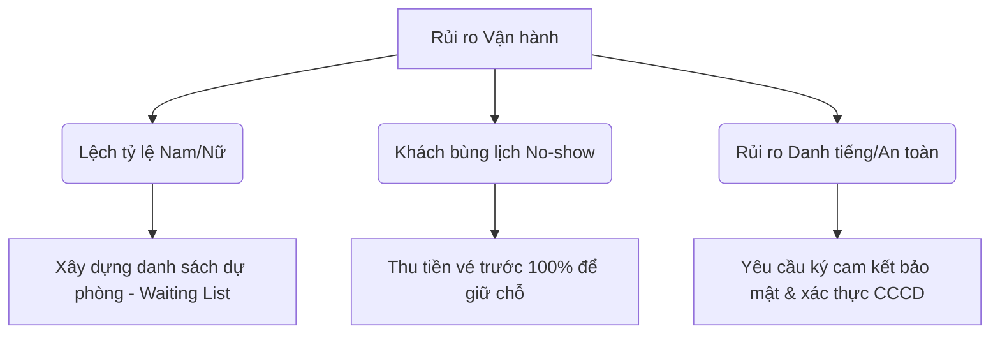

# BÀI TOÁN KINH DOANH: CƠ HỘI, RỦI RO & PHÂN TÍCH NGUỒN LỰC (DATING STATION HẢI PHÒNG)

Tài liệu này phân tích bài toán tài chính, các cơ hội thị trường, rủi ro vận hành, nguồn lực cần thiết và đặc biệt là **những vấn đề cốt lõi không thể giải quyết triệt để** khi vận hành mô hình hẹn hò trực tiếp tại Hải Phòng.

---

## 1. BÀI TOÁN KINH DOANH (BUSINESS FINANCIAL CASE)

Dưới đây là mô hình tài chính giả định cho **01 Sự kiện Hẹn hò Tiêu chuẩn (30 khách hàng - 15 Nam & 15 Nữ)** tại Hải Phòng.

### 1.1. Dự toán Doanh thu & Chi phí (Mức vé trung cấp: 499.000 VNĐ/vé)

| Danh mục | Chi tiết | Thành tiền (VNĐ) |
| :--- | :--- | :--- |
| **TỔNG DOANH THU** | **30 khách x 499.000 VNĐ** | **14.970.000** |
| **Chi phí Biến đổi (Variable Costs)** | | |
| - Chi phí F&B (Nước + Teabreak) | 30 phần x 80.000 VNĐ | 2.400.000 |
| - Quà tặng lưu niệm (Nến thơm/Sách) | 30 phần x 40.000 VNĐ | 1.200.000 |
| - In ấn Match Card, Prompt Card | Bản in màu + Bút viết | 300.000 |
| **Chi phí Cố định (Fixed Costs)** | | |
| - Thuê địa điểm (Lounge/Cafe VIP) | Gói bao trọn khu vực riêng (3 giờ) | 2.500.000 |
| - Thù lao MC/Host dẫn dắt | Nhân sự chuyên nghiệp | 1.200.000 |
| - Marketing & Lọc hồ sơ | Chạy quảng cáo Facebook Ads + Telesale lọc tin | 2.500.000 |
| - Nhân sự điều phối/Đón khách | 2 bạn hỗ trợ check-in, xoay bàn | 600.000 |
| **TỔNG CHI PHÍ** | | **10.700.000** |
| **LỢI NHUẬN RÒNG/EVENT** | **Doanh thu - Chi phí** | **4.270.000 (28.5%)** |

> [!TIP]
> **Tối ưu hóa lợi nhuận:** Khi thương hiệu đã có uy tín, chi phí Marketing/Lọc hồ sơ trên mỗi sự kiện sẽ giảm xuống còn 30-40% nhờ tệp khách đăng ký tự nhiên (Organic) và khách hàng cũ giới thiệu. Đồng thời có thể nâng giá vé lên phân khúc cao cấp hơn (690.000 VNĐ - 890.000 VNĐ/vé).

---

## 2. CƠ HỘI THỊ TRƯỜNG TẠI HẢI PHÒNG (OPPORTUNITIES)

1.  **Đại dương xanh (Blue Ocean):** Thị trường Hải Phòng chưa có đơn vị tổ chức hẹn hò trực tiếp chuyên nghiệp, bài bản và có gu thẩm mỹ cao. Phần lớn vẫn là các group Facebook tự phát hoặc dịch vụ mai mối kiểu cũ, thiếu tinh tế.
2.  **Khả năng chi trả cao:** Người Hải Phòng rất sòng phẳng và chịu chi cho các dịch vụ mang lại giá trị thực tế. Mức giá vé 500k - 900k hoàn toàn nằm trong khả năng của tệp dân văn phòng, logistics và chủ kinh doanh tại đây.
3.  **Vấn đề độc thân tăng cao:** Áp lực công việc và xu hướng kết hôn muộn ở Hải Phòng đang gia tăng rõ rệt, trong khi không gian giải trí lành mạnh để kết nối xã hội ngoài giờ làm việc lại rất hạn chế.

---

## 3. RỦI RO VẬN HÀNH & PHƯƠNG ÁN GIẢM THIỂU (RISKS)

*   **Rủi ro lệch tỷ lệ giới tính (Gender Imbalance):**
    *   *Mô tả:* Sự kiện đến sát giờ chỉ có 12 nam nhưng có tới 18 nữ (hoặc ngược lại). Điều này phá vỡ cấu trúc xoay vòng bàn.
    *   *Khắc phục:* Duy trì một "Waiting List" (danh sách chờ). Chỉ xác nhận và nhận chuyển khoản khi khớp đủ cặp. Có chính sách tặng voucher hoặc hoàn tiền cho khách dự phòng nếu không được xếp lịch.
*   **Khách hủy lịch sát giờ (No-show):**
    *   *Mô tả:* Khách đã đóng tiền nhưng đột xuất không đến, gây trống bàn.
    *   *Khắc phục:* Thu tiền vé trước 100% để tăng tính cam kết. Có điều khoản: *Hủy trước 48h được bảo lưu sang số sau, hủy sau 48h mất phí 100%*.
*   **Rủi ro truyền thông tiêu cực (Reputation Risk):**
    *   *Mô tả:* Khách hàng có trải nghiệm không tốt, hoặc gặp đối tượng quấy rối sau sự kiện và bóc phốt lên các hội nhóm Hải Phòng.
    *   *Khắc phục:* Thiết lập quy tắc ứng xử (Code of Conduct) rõ ràng. Khách hàng vi phạm hoặc có thái độ khiếm nhã sẽ bị đưa vào danh sách đen (Blacklist) vĩnh viễn và BTC từ chối cung cấp dịch vụ kết nối.

---

## 4. NGUỒN LỰC CẦN HUY ĐỘNG (RESOURCES REQUIRED)

### 4.1. Nguồn nhân lực cốt lõi (Human Resources)
*   **MC/Host (Cực kỳ quan trọng):** Cần một người có giọng nói ấm áp, ngoại hình sáng, có sự duyên dáng, tinh tế để kết nối mọi người và xóa tan bầu không khí ngượng ngùng lúc đầu. MC không được quá sến hoặc quá cợt nhả.
*   **Chuyên viên Lọc Hồ Sơ & CSKH:** Người trực tiếp duyệt form, gọi điện thẩm định thái độ và kết nối các cặp đôi sau sự kiện. Nhân sự này cần có sự thấu cảm cao và bảo mật thông tin tốt.
*   **Nhân sự chạy quảng cáo (Ads & Content Creator):** Viết content chạm đúng nỗi đau của người độc thân Hải Phòng, thiết kế hình ảnh sang trọng để chạy quảng cáo.

### 4.2. Đối tác chiến lược (Partnerships)
*   **Địa điểm liên kết:** Ký hợp đồng dài hạn với các quán cafe/lounge phân khúc cao cấp tại Hải Phòng để có giá thuê tốt và đảm bảo không gian riêng tư cố định hàng tháng.
*   **Nhà cung cấp quà tặng/workshop:** Các đơn vị làm nến thơm handmade, làm đồ da, vẽ tranh tại Hải Phòng để hợp tác tổ chức Workshop Dating.

---

## 5. NHỮNG VẤN ĐỀ ĐÁNG NGẠI KHÔNG THỂ GIẢI QUYẾT TRIỆT ĐỂ (UNRESOLVABLE CONCERNS)

Đây là những "nỗi đau" cố hữu của mô hình kinh doanh này mà chúng ta buộc phải chấp nhận, sống chung và tìm cách hạn chế tối đa, chứ không thể giải quyết triệt để 100%:

### 5.1. Tâm lý "Sợ đàm tiếu ở thành phố nhỏ" (Small City Gossip)
*   **Bản chất:** Hải Phòng tuy là thành phố trực thuộc Trung ương nhưng vòng kết nối xã hội rất đan xen (quen qua bạn của bạn, đồng nghiệp cũ, đối tác kinh doanh...). Người Hải Phòng có lòng tự tôn rất cao, rất sợ bị đồn là *"phải đi xem mắt mới có người yêu"* hoặc *"bị ế"*.
*   **Hệ quả:** Khách hàng chất lượng cao (VIP, có địa vị) rất ngại đến sự kiện công khai vì sợ gặp người quen tại đó.
*   **Giải pháp hạn chế:** Tổ chức các buổi hẹn hò 1-on-1 (hẹn hò riêng tư) được BTC thiết lập riêng tại phòng VIP thay vì các buổi Speed Dating đông người.

### 5.2. Sự bất đối xứng thông tin & Sự thiếu trung thực (Asymmetric Information)
*   **Bản chất:** Dù BTC có yêu cầu khách hàng cung cấp Căn cước công dân (CCCD), link mạng xã hội, hoặc cam kết tình trạng hôn nhân bằng văn bản, chúng ta **không có thẩm quyền pháp lý** để tra cứu cơ sở dữ liệu quốc gia xem họ có thực sự đã ly hôn, đang ly thân hay đang bắt cá hai tay ở ngoài hay không.
*   **Hệ quả:** Vẫn có tỷ lệ nhỏ đối tượng không trung thực lọt qua vòng kiểm duyệt (ví dụ: đã có gia đình nhưng nói dối để đi tìm mối quan hệ ngoài luồng). Nếu xảy ra xung đột, danh tiếng của Dating Station sẽ bị ảnh hưởng lớn.
*   **Giải pháp hạn chế:** Yêu cầu khách ký **Cam kết độc thân** trước sự kiện. Xây dựng cơ chế báo cáo ẩn danh sau sự kiện: Nếu khách phát hiện đối phương lừa dối, BTC sẽ lập tức khóa tài khoản và cảnh báo cho các thành viên khác.

### 5.3. Quy luật "Hiệu suất giảm dần" của tệp độc thân chất lượng (Shrinking Pool Problem)
*   **Bản chất:** Tệp khách hàng mục tiêu tại Hải Phòng (Độc thân + Nghiêm túc + Thu nhập khá trở lên + Độ tuổi 28-35) là một tệp **có giới hạn**.
*   **Hệ quả nghịch lý:** 
    *   Nếu chúng ta làm quá tốt -> Các cặp đôi match thành công và rời khỏi nền tảng (mất khách hàng).
    *   Nếu chúng ta làm tệ -> Khách hàng thất vọng và rời đi.
    *   Số lượng khách hàng mới gia nhập tệp độc thân chất lượng mỗi năm tại Hải Phòng không đủ nhanh để bù đắp. Theo thời gian, những người tham gia sự kiện sẽ bắt đầu thấy *"toàn người quen cũ"* hoặc những gương mặt đi đi lại lại nhiều lần.
*   **Giải pháp hạn chế:** Liên tục mở rộng sang các tỉnh thành lân cận (Quảng Ninh, Hải Dương) để tạo dòng luân chuyển khách hàng chéo giữa các sự kiện. Đồng thời đa dạng hóa dịch vụ sang mảng tư vấn tâm lý, đào tạo kỹ năng hẹn hò (Coaching) để khai thác thêm giá trị từ tệp khách hàng cũ.
