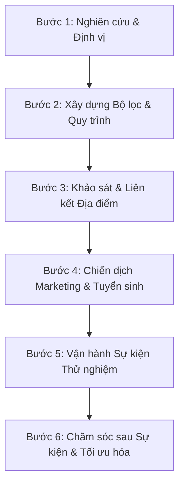

# PHÂN TÍCH CHƯƠNG TRÌNH SỰ KIỆN HẸN HÒ TẠI VIỆT NAM & KẾ HOẠCH TRIỂN KHAI TẠI HẢI PHÒNG

Tài liệu này phân tích sâu sắc về tâm lý, văn hóa hẹn hò của người Việt Nam nói chung và người Hải Phòng nói riêng, từ đó đề xuất các mô hình sự kiện hẹn hò thực tế, hiệu quả và có tỷ lệ thành công cao.

---

## 1. BỐI CẢNH & THỰC TRẠNG HẸN HÒ TẠI VIỆT NAM

### 1.1. Thực trạng "Kiệt sức vì Hẹn hò trực tuyến" (Dating App Fatigue)
*   **Vấn đề:** Các ứng dụng như Tinder, Bumble, OkCupid từng bùng nổ nhưng hiện tại đang bão hòa. Người dùng đối mặt với tình trạng:
    *   *Ghosting* (đang nói chuyện đột ngột biến mất).
    *   *Catfishing* (ảnh và thông tin khác xa thực tế).
    *   Tệp người dùng tạp nham, không cùng mục tiêu (nhiều đối tượng tìm kiếm mối quan hệ ngắn hạn FwB/ONS, lừa đảo tài chính, bán hàng đa cấp).
*   **Xu hướng:** Người độc thân nghiêm túc (đặc biệt nhóm tuổi 25-35) có xu hướng quay về với **hẹn hò trực tiếp (Offline Dating)** để "nhìn tận mắt, nghe tận tai", tiết kiệm thời gian lọc hồ sơ ảo.

### 1.2. Sự dịch chuyển từ "Mai mối truyền thống" sang "Ghép đôi khoa học"
*   **Kiểu truyền thống:** Gia đình giới thiệu hoặc qua các dịch vụ môi giới truyền thống thường mang tính gượng ép, thiếu tự nhiên và tạo áp lực tâm lý lớn cho người tham gia.
*   **Kiểu hiện đại (Speed/Blind Dating):** Được thiết kế như một buổi giao lưu xã hội (Socializing), nơi mọi người đến để trải nghiệm không gian đẹp, đồ uống ngon và gặp gỡ nhiều người cùng lúc một cách văn minh, nhẹ nhàng và tự nhiên.

---

## 2. ĐẶC TRƯNG TÂM LÝ & VĂN HÓA HẸN HÒ NGƯỜI VIỆT

Khi thiết kế sự kiện hẹn hò tại Việt Nam, bắt buộc phải hiểu các rào cản tâm lý văn hóa sau:

| Đặc điểm tâm lý | Biểu hiện | Giải pháp thiết kế sự kiện |
| :--- | :--- | :--- |
| **Sợ mất mặt (Fear of Rejection)** | Cả nam và nữ đều ngại thừa nhận mình "ế" hoặc chủ động xin thông tin trực tiếp vì sợ bị từ chối trước mặt người khác. | **Bảo mật kết quả:** Khách hàng không ghép đôi trực tiếp tại bàn. Họ điền vào "Match Card" (Phiếu lựa chọn). Ban tổ chức (BTC) sẽ kết nối và gửi thông tin liên lạc sau sự kiện nếu cả hai cùng chọn nhau (Double Match). |
| **Sự gượng gạo ban đầu (Awkwardness)** | Người Việt thường rụt rè trong 5-10 phút đầu tiên khi gặp người lạ, dễ rơi vào trạng thái im lặng đáng sợ (Dead air). | **Trò chơi phá băng (Ice-breakers) & Bộ câu hỏi gợi ý (Prompt cards):** Đặt sẵn các thẻ câu hỏi thú vị, sâu sắc tại bàn (tránh câu hỏi nhạt nhẽo như "Quê ở đâu?", "Làm nghề gì?"). |
| **Yếu tố gia đình & Sự ổn định** | Văn hóa miền Bắc đặc biệt coi trọng sự phù hợp về nền tảng giáo dục, sự nghiệp và định hướng nghiêm túc. | **Lọc hồ sơ đầu vào (Curated):** BTC cần cam kết xác thực thông tin cơ bản và ghép nhóm sự kiện theo độ tuổi/phân khúc (Ví dụ: nhóm học thức cao, nhóm kinh doanh tự do, nhóm hướng nội,...). |

---

## 3. PHÂN TÍCH TỆP KHÁCH HÀNG & ĐẶC TRƯNG VĂN HÓA HẢI PHÒNG

Hải Phòng là một thị trường cực kỳ tiềm năng nhưng có những đặc thù rất riêng biệt so với Hà Nội hay TP.HCM.

### 3.1. Tính cách đặc trưng của người Hải Phòng (The HP Persona)
*   **Thẳng thắn & Thực chất ("Ăn sóng nói gió"):** Người Hải Phòng ghét sự màu mè, giả tạo hay sến súa quá đà. Họ thích sự rõ ràng, chân thành và trực diện.
*   **Sòng phẳng & Chịu chi:** Thu nhập bình quân tại Hải Phòng rất tốt (đặc biệt là giới kinh doanh, dân làm logistics, cảng biển, văn phòng cao cấp). Họ sẵn sàng chi trả mức giá cao nếu dịch vụ mang lại giá trị xứng đáng, không gian sang trọng và tệp khách tham gia chất lượng.
*   **Cộng đồng kết nối mạnh:** Hải Phòng là thành phố lớn nhưng vòng kết nối xã hội lại khá nhỏ. Người ta rất dễ "quen người quen". Đây là con dao hai lưỡi:
    *   *Điểm cộng:* Dễ truyền thông truyền miệng (Word-of-mouth).
    *   *Điểm trừ:* Khách ngại tham gia vì sợ gặp phải người quen hoặc bị bàn tán. **Do đó, tính bảo mật hình ảnh và thông tin tại sự kiện phải được đặt lên hàng đầu.**

### 3.2. Chân dung khách hàng mục tiêu tại Hải Phòng
*   **Độ tuổi:** 26 - 36 tuổi (Giai đoạn chín muồi về sự nghiệp, chịu áp lực lập gia đình lớn).
*   **Nghề nghiệp:** Nhân sự logistics/xuất nhập khẩu, ngân hàng, công chức nhà nước, chủ doanh nghiệp vừa và nhỏ, chủ shop kinh doanh thời trang/F&B.
*   **Mức thu nhập:** 15.000.000 VNĐ - 40.000.000+ VNĐ/tháng.
*   **Nhu cầu cốt lõi:** Tìm kiếm bạn đời nghiêm túc, muốn mở rộng vòng quan hệ chất lượng, thiếu thời gian và cơ hội gặp gỡ người mới ngoài ngành nghề của mình.

---

## 4. ĐỀ XUẤT FORMAT CHƯƠNG TRÌNH PHÙ HỢP CHO HẢI PHÒNG

Dựa trên đặc tính **"thích thực chất, ghét sến súa, đề cao sự tinh tế"** của người Hải Phòng, đề xuất 3 format sự kiện cốt lõi:

### Format 1: Classic Speed Dating – "Trạm Kết Nối Cao Cấp"
*   **Quy mô:** 10 Nam - 10 Nữ (đã qua lọc hồ sơ để tương đồng về độ tuổi và học vấn/thu nhập).
*   **Cơ chế hoạt động:**
    *   Mỗi cặp đôi có **7 - 8 phút** trò chuyện riêng tư tại bàn đôi.
    *   Hết giờ, rung chuông hiệu lệnh, các bạn nam sẽ di chuyển xoay vòng sang bàn tiếp theo.
    *   Mỗi người được phát 1 bảng đánh giá bí mật (Match Card) để tích chọn những người mình muốn giữ liên lạc.
*   **Điểm nhấn phù hợp HP:** Không gian tổ chức phải cực kỳ riêng tư (Ví dụ: khu vực VIP được bao trọn của một Lounge/Cafe sang trọng, ánh sáng ấm, nhạc Jazz nhẹ, khoảng cách giữa các bàn đủ xa để không nghe thấy cuộc trò chuyện của bàn bên cạnh).

### Format 2: Blind Dating (Hẹn Hò Giấu Mặt) – "Thính Giác & Cảm Xúc"
*   **Quy mô:** 8 Nam - 8 Nữ.
*   **Cơ chế hoạt động:**
    *   Giai đoạn 1 (30 phút đầu): Khách hàng đeo mặt nạ nửa mặt (Masquerade) hoặc trò chuyện qua một vách ngăn/rèm mỏng trong điều kiện ánh sáng mờ. Họ tập trung hoàn toàn vào giọng nói, tư duy và quan điểm sống.
    *   Giai đoạn 2: BTC tổ chức một mini-game nhỏ để mọi người tháo mặt nạ, lộ diện diện mạo và tiếp tục trò chuyện tự do.
*   **Điểm nhấn phù hợp HP:** Tạo sự huyền bí, giảm bớt áp lực về ngoại hình ban đầu, khơi gợi trí tò mò của người tham gia. Rất phù hợp với tệp khách hàng hướng nội hoặc những người có vị thế xã hội ngại lộ mặt ngay từ đầu.

### Format 3: Workshop Dating (Hẹn Hò Trải Nghiệm) – "Kết Nối Qua Hành Động"
*   **Quy mô:** 12 Nam - 12 Nữ.
*   **Cơ chế hoạt động:**
    *   Thay vì chỉ ngồi đối diện nói chuyện, khách hàng tham gia vào một hoạt động thực tế theo cặp (được BTC xoay vòng đổi cặp giữa chừng):
        *   *Workshop pha chế Cocktail/Mocktail (Mixology).*
        *   *Workshop làm bánh ngọt hoặc vẽ tranh canvas.*
        *   *Workshop cắm hoa nghệ thuật hoặc làm đồ da handmade.*
*   **Điểm nhấn phù hợp HP:** Giảm 90% sự gượng gạo. Người tham gia có thể dễ dàng bắt chuyện thông qua việc tương tác với sản phẩm ("Anh giúp em giữ cái này với", "Món nước của bạn pha ngon quá",...). Khách hàng Hải Phòng vốn thực tế, họ sẽ cảm thấy số tiền bỏ ra xứng đáng vì vừa có trải nghiệm mang sản phẩm về, vừa được gặp gỡ bạn bè.

---

## 5. ĐỊA ĐIỂM GỢI Ý TẠI HẢI PHÒNG

Địa điểm phải đảm bảo các tiêu chí: **Sang trọng, Riêng tư, Trung tâm, Đồ uống chất lượng tốt.**

1.  **Khu vực Vinhomes Imperia / Thượng Lý:**
    *   Nơi tập trung nhiều quán Cafe/Lounge phân khúc cao cấp, không gian rộng rãi, đỗ xe ô tô thuận tiện.
    *   Phù hợp cho tệp khách trẻ, doanh nhân, năng động.
2.  **Khu vực Lạch Tray / An Đà / Lê Hồng Phong:**
    *   Trục đường trung tâm, dễ tìm. Các quán cafe mang phong cách cổ điển, ấm cúng hoặc các quán Bar ẩn mình (Speakeasy Bar) rất hợp cho Blind Dating buổi tối.
3.  **Các khách sạn 5 sao (Sheraton Hai Phong, Mercure Hai Phong, Avani):**
    *   Thuê phòng họp nhỏ hoặc khu vực riêng tại Sky Bar/Executive Lounge.
    *   Dành riêng cho tệp khách VIP (High-end Dating) với giá vé cao hẳn để lọc đối tượng triệt để.

---

## 6. KẾ HOẠCH TRIỂN KHAI CHI TIẾT (ACTION PLAN)

### Bước 1: Thiết lập Hệ thống Lọc Đầu Vào (Khóa Vàng Bảo Mật)
*   Xây dựng Form đăng ký chi tiết (sử dụng Typeform/Google Form chuyên nghiệp hoặc tích hợp vào website).
*   Yêu cầu bắt buộc cung cấp: Ảnh chân dung thực tế (không filter quá đà), Link Facebook/Instagram/LinkedIn chính chủ, thông tin công việc và khảo sát quan điểm sống.
*   BTC có bộ phận gọi điện/chat thẩm định trực tiếp trước khi nhận thanh toán vé sự kiện.

### Bước 2: Truyền Thông & Marketing (Tiếp cận tệp Độc Thân Hải Phòng)
*   **Định vị thương hiệu:** "Trạm Hẹn Hò Hải Phòng - Nơi kết nối những tâm hồn độc thân chất lượng và nghiêm túc".
*   **Kênh tiếp cận:**
    *   *Facebook/TikTok Ads:* Nhắm mục tiêu khu vực Hải Phòng, độ tuổi 25-35, sở thích quan tâm đến các thương hiệu cao cấp, golf, du lịch, sách, phát triển bản thân.
    *   *KOLs/KOCs Hải Phòng:* Review trải nghiệm dịch vụ hẹn hò trực tiếp một cách tinh tế (tập trung vào tính văn minh, vui vẻ, không sến).
    *   *Hợp tác chéo (Cross-marketing):* Đặt tờ rơi/hợp tác với các trung tâm Fitness cao cấp, phòng khám thẩm mỹ, hoặc các quán cafe đẹp tại Hải Phòng.

### Bước 3: Quy Trình Vận Hành Ngày Diễn Ra Sự Kiện (Event Day Run-sheet)
1.  **Đón khách (15 phút):** Check-in bảo mật, phát số báo danh đeo ngực, tặng welcome drink. Hướng dẫn khách ngồi vào vị trí khởi đầu.
2.  **Khai mạc & Phá băng (15 phút):** MC giới thiệu luật chơi ngắn gọn, tổ chức game nhẹ nhàng để giải tỏa căng thẳng.
3.  **Vòng xoay hẹn hò (Speed Dating) (90 phút):** Trò chuyện xoay vòng xoay bàn (7 phút/bàn). Giữa giờ có 10 phút nghỉ giải lao (Teabreak).
4.  **Tổng kết & Điền Match Card (15 phút):** Khách điền thông tin người mình thích vào phiếu kín và gửi lại BTC.
5.  **Kết thúc:** Phát quà tặng lưu niệm tinh tế (ví dụ: một cuốn sách hay, một hộp nến thơm nhỏ thương hiệu địa phương).

### Bước 4: Chăm sóc & Match-making sau sự kiện
*   Trong vòng **24 - 48 giờ** sau sự kiện: BTC tổng hợp kết quả Match Card.
*   Gửi email/tin nhắn riêng thông báo kết quả. Nếu có cặp đôi trùng khớp (Double Match), BTC sẽ chia sẻ thông tin liên lạc (Số điện thoại/Zalo) để họ tự chủ động kết nối.
*   *Chăm sóc nâng cao:* Với những người chưa match, BTC gửi feedback góp ý tinh tế về cách trò chuyện, trang phục hoặc gợi ý các tệp đối tượng phù hợp hơn cho sự kiện lần sau.
